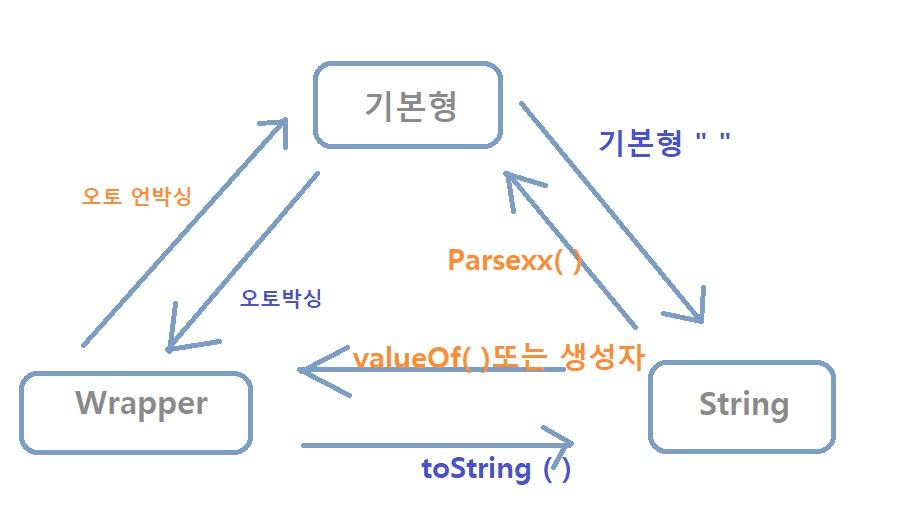

## 자바 String 관련 함수 정리 

1. toLowerCase() / toUpperCase()
    문자열을 모두 소문자나 대문자로 변경하고자할 때 사용한다.
    ```
    str = str.toLowerCase();
    c = Character.toLowerCase(c);
   ```

2. String을 한 글자씩 파악하고 싶을 때
   1. charAt()
       지정한 index의 문자를 반환한다.
      ```java
      for (int i = 0; i < str.length(); i++) {
         System.out.println(str.charAt(i));
      }
      ```
   2. toCharArray()
       ```java
      /* forEach문 : String을 charArray으로 변경한 후 비교 */
      for (char x : str.toCharArray()) {
          if (x == c) answer++;
      }
      ```

3. split(regex)
4. indexOf(regex)
   발견하지 못하면 -1, 발견하면 인덱스를 반환한다.


## 자바 Character 클래스 관련 메소드
1. Character.isUpperCase(c)
    is~() : 특정 대상인지를 판별
    - 대/소문자 : Character.isUpperCase(c), Character.isLowerCase(c)
    - 문자 : Character.isLetter(c)
    - 숫자 : Character.isDigit(c)
    - 공백문자 : Character.isWhitespace(c)

    toXXX() : 특정 대상 타입으로 변환
   - 대.소문자 : Character.toUpperCase(c), Character.toLowerCase(c)
- 

### 출처
https://itellyhood.tistory.com/71