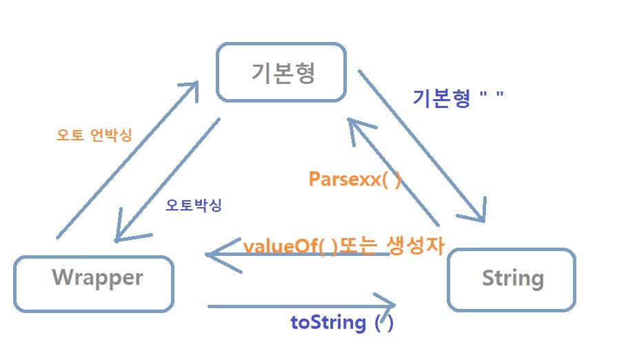

1. 중복문자제거
   * indexOf로 문자의 위치와 문자가 처음 나타난 위치를 비교해서 중복문자 찾기
   ```java
   // 자기 위치(charAt())와 처음 발견된 위치(indexOf())가 다르면 중복 문자이다.
   System.out.println(str.charAt(i)+ " " + i + " " + str.indexOf(str.charAt(i)));
   ```
2. 회문문자열
      * 문자열의 반만 탐색하여 문자열이 대칭인지 확인
      * ```java
           int len = str.length(); // 문자열 길이가 홀수일때 정 가운데 위차한 글자는 대칭을 고려하지 않아도 된다.
           for(int i = 0; i < len/2; i++) {
                  if(str.charAt(i) != str.charAt(len-i-1)){
                      return "NO";
               }
           }
      * StringBuilder().reverse && (String.equalsIgnoreCase() || String.equals()) 활용
      * ```java
        String tmp = new StringBuilder(str).reverse().toString();
        if(str.equalsIgnoreCase(tmp)) answer="YES";
        ```

3. 문자거리 구하기
   - 먼저, 문자 간 거리를 나타내는 변수 p와 문자 간 최단 길이를 저장하는 int 배열 answer을 생성한다.
     p는 문제 조건을 확인한 후 가장 큰 값으로 둔다. Ex. p=1000
   - 오른쪽, 왼쪽 방향으로 두 번 탐색을 진행한다.
     - 오른쪽 방향 탐색은 왼쪽 e와의 거리만 탐색할 수 있다.
     - 왼쪽 방향 탐색은 오른쪽 e와의 거리만 탐색할 수 있다.
     - 한 방향으로만 탐색하여 문자 거리를 계산하면 최솟값이 될 수 없기 때문에 양쪽 뱡향을 모두 탐색하여 값을 업데이트 한다.

4. 문자열 압축
    * 문자열의 i번째 문자와와 i+1번째 문자를 비교하기
    * 이때, 문자열의 맨 마지막 문자의 경우 i+1 인덱스가 존재하지 않아 에러가 발생한다.
    * 이를 방지하기위해 **문자열 뒤에 빈 문자를 하나 추가**해준다.
    > ‼️ 향상된 for문 + String.toCharArray()로 문자열 탐색 시
    맨 마지막 문자 처리에 주의할 것 !
    처음에 작성한 코드는 `abbccc`에 대한 출력으로 `ab2`가 나옴
    ```java
   /* 마지막 문자 c (ccc)에 대한 처리를 하셔야 합니다~ */
   for(char c: str.toCharArray()){
       if(c == prev) { 
           num++;
   }
   ```
   
   
   

## String 관련 함수 정리 

1. toLowerCase() / toUpperCase()
    문자열을 모두 소문자나 대문자로 변경하고자할 때 사용한다.
    ```
    str = str.toLowerCase();
    c = Character.toLowerCase(c);
   ```

2. String을 한 글자씩 파악하고 싶을 때
   1. charAt(int index)
       지정한 index의 문자를 반환한다.
      ```java
      for (int i = 0; i < str.length(); i++) {
         System.out.println(str.charAt(i));
      }
      ```
   2. toCharArray()
       ```java
      /* forEach문 : String을 charArray으로 변경한 후 비교 */
      for (char x : str.toCharArray()) {
          if (x == c) answer++;
      }
      ```

3. split(regex)
4. indexOf(regex)
   해당 문자의 위치를 int로 반환, 발견하지 못하면 -1, 발견하면 인덱스를 반환한다.
```java
//String 클래스의 주요속성 또는 메서드 정리
public class StringDemo {
   
    public static void main(String[] args) {
        String str = " Abc Def Fed Cba ";
        System.out.println(str); //전체 출력
        System.out.println("문자열 길이 : "+str.length()); //문자열의 길이
        System.out.println("str.charAt(5)=>"+str.charAt(5)); 
        //특정 인덱스에 해당하는 문자(char) 추출 : D
        System.out.println("str.indexOf('F')=>"+str.indexOf('F')); 
        //특정 문자열 또는 문자가 몇번째 인덱스에 위치하는지 : 9
        System.out.println("str.indexOf(\"Fed\")=>"+str.indexOf("Fed")); 
        //특정 문자열 또는 문자가 몇번째 인덱스에 위치하는지 : 9
        System.out.println("str.indexOf(\"XYZ\")=>"+str.indexOf("XYZ")); 
        //특정 문자 또는 문자열이 없을때 -1을 반환
        System.out.println("str.lastIndexOf(\"e\")=>"+str.lastIndexOf("e"));
        //뒤에서부터 검색. 단, 인덱스는 앞에서부터 : 10      
        System.out.println("str.indexOf('e', 7)=>"+str.indexOf('e', 7)); 
        //n번째 인덱스 이후로 검색:10
        System.out.println("str.trim()=>"+str.trim()+", 문자열 길이 :"+str.trim().length()); 
        // 문자열의 앞뒤 공백제거 , 17-2=15
        //문자열 치환, 공백(white space) 제거 후 Abc -> abc로 , 결과 : aBCDefFedCba
        System.out.println("str.replace(\" \", \"\").replace(\"Abc\", \"aBC\")=>"+str.replace(" ", "").replace("Abc", "aBC"));
        System.out.println("str.substring(5,8)=>"+str.substring(5,8));
        //n번째 인덱스 ~m-1번째 인덱스 까지의 문자열 검색,Def
        System.out.println("str.substring(5)=>"+str.substring(5)); 
        //n번째 인덱스 이후의 문자열 검색,Def Fed Cba  
       
        char[] buff= new char[3];
        str.getChars(5, 8, buff, 0); // buff = "Def";
        System.out.println(buff); //Def
       
        String s1 = "Test";
        String s2 = "test";
        System.out.println("s1.equals(s2)=>"+s1.equals(s2)); //false , 문자열 비교
        System.out.println("s1.equalsIgnoreCase(s2)=>"+s1.equalsIgnoreCase(s2));
        //true , 대소문자 구분하지 않고 비교
       
        String url = "http://javaking75.blog.me";
        System.out.println("url.startsWith(\"http\")=>"+url.startsWith("http")); 
        //~로 시작하는지 : true
        System.out.println("url.endsWith(\".net\")=>"+url.endsWith(".net")); 
        //~로 끝나는지 : false
       
        int year = 2011;
        System.out.println(year + year); //성질 자체를 문자열로 변환 : 4022
        System.out.println(String.valueOf(year) + String.valueOf(year));
        //성질 자체를 문자열로 변환 : 20112011
       
        System.out.println("abcd".toUpperCase());//대문자로 출력:ABCD
        System.out.println("ABCD".toLowerCase());//소문자로 출력:abcd
    }
}
 
```
## StringBuilder 클래스 관련 메소드
1. reverse() : 문자열 뒤집기 
```java
String tmp = new StringBuilder(s).reverse().toString();
``` 
  * 직접 문자를 뒤집고 싶다면
    * String을 char 배열로 바꾼다.
    * lt(배열의 맨 왼쪽 포인터), rt(배열의 맨 오른쪽 포인터)를 활용한다.
      * ```java
        while(lt < rt) {
            if(조건) { swap(arr[lt], arr[rt]);}
            lt++; rt--;
        }
        ```


## Character 클래스 관련 메소드
1. Character.isUpperCase(c)
    is~() : 특정 대상인지를 판별
    - 대/소문자 : Character.isUpperCase(c), Character.isLowerCase(c)
    - 문자 : Character.isLetter(c)
    - 숫자 : Character.isDigit(c)
    - 공백문자 : Character.isWhitespace(c)

    toXXX() : 특정 대상 타입으로 변환
   - 대.소문자 : Character.toUpperCase(c), Character.toLowerCase(c)
- 

- Character.toString(c) : char -> String 타입 변환

### 출처
https://itellyhood.tistory.com/71
https://velog.io/@donglee99/JAVA-String-%ED%81%B4%EB%9E%98%EC%8A%A4-%EC%A0%95%EB%A6%AC
https://m.blog.naver.com/PostView.naver?isHttpsRedirect=true&blogId=javaking75&logNo=140187408692