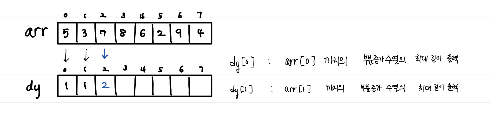
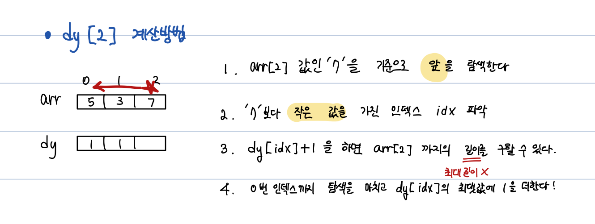
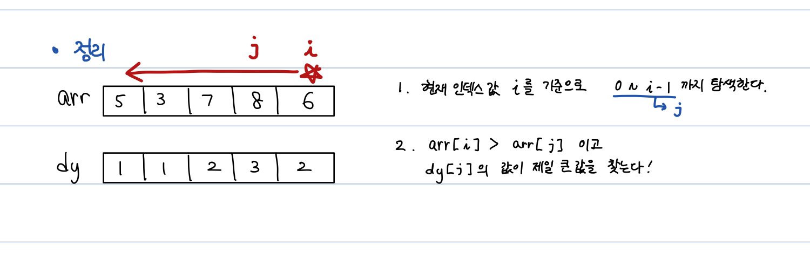
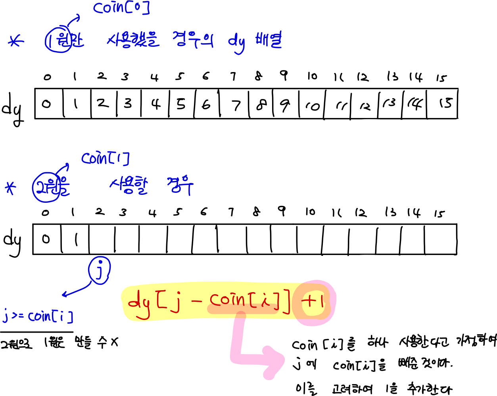

## 동적계획법 
큰 문제를 작은 단위로 쪼갠다.

1. 최대 부분 증가수열 (LIS)
- 문제
  - 가장 작은 수 / 큰 수를 먼저 찾아야하나?
- 해결법
  - 부분 증가 수열의 최대 길이를 저장하는 dy 배열 생성 
    
  
  

2. 가장 높은 탑 쌓기 (LIS 응용)
- 문제
  - 밑면의 넓이나 무게로 내림차순 정렬을 먼저 해야하나
  - dy 배열 만들어서 탑의 높이 계산하기
- 해결법
  - (조건4) 밑면의 넓이를 내림차순으로 정렬한다.
  - 정렬된 배열에서 자기 자신(i)의 앞을 탐색한다.
  - (조건5) 무게를 비교하여 자신보다 더 가벼운 벽돌 중 가장 높이가 높은 값을 찾는다.
  - 찾은 높이 값에 자신의 높이 값을 더하고 dy[i]에 값을 저장한다.
  - 기억할 것
    - 이중포문 안에서 maxH, dy, answer 값 다 처리하려하지말자
    - maxH만 알면 dy, answer 둘 다 처리할 수 있다.
    - 풀이를 좀 잘 정리한 다음에 코드 작성하기
    - 정렬 
      ```java
        class Brick implements Comparable<Brick> {
          int s, h, w;
          
            Brick(int s, int h, int w){
              this.s = s;
              this.h = h;
              this.w = w;
            }

            @Override
            public int compareTo(Brick o){
              return o.s - this.s;
            }
        } 
      ```
3. 동전교환(냅색 알고리즘)
- 주의
  - 동전 갯수가 50개 이상 넘어가면 DFS로 풀 때 1초 시간 제한을 초과한다. 
  - DP로 풀자 !
- 해결법
  - dy[i] : i 금액을 만드는데 드는 동전의 최소 개수, dy[10] = 10원을 만드는데 필요한 동전의 최소 개수
  
  - 동전을 하나 하나 추가하면서 더 좋은 방법으로 갱신해 나감
    - 처음 dy 배열은 `Arrays.fill(dy, Integer.MAX_VALUE)`을 활용하여 최대값으로 둔다.
  
  - dy[2] = dy[2-2] + 1 = 0 + 1 = 1 (2원 동전 1개)
  - dy[3] = dy[3-2] + 1 = 1 + 1 = 2 (1원 동전 1개, 2원 동전 1개)
  - dy[4] = dy[4-2] + 1 = 1 + 1 = 2 (2원 동전 2개)


4. 최대점수 구하기(냅색 알고리즘)
- 주의
  - N 제한이 12일 땐 DFS로 풀었지만 지금은 N이 50까지라 DP로 풀어야한다.
- 해결법
  - dy[j]: j분 내에 풀 수 있는 최대 점수
  - dy[16]: 16분 내에 풀 수 있는 최대 점수
  - 3번 동전교환 문제와 달리 이건 j가 뒤에서 부터 탐색을 해야한다.
    - why? 동전의 경우 무한대로 동전을 반복하여 사용할 수 있었지만, 4번 최대 점수 구하기에서 문제는 한 번만 풀 수 있다 !
    - 동전교환처럼 앞에서부터 탐색하면 문제를 중복해서 풀었다고 판단하여 옳지 않은 값을 리턴한다.
    

> **냅색 알고리즘**: 
보석의 종류가 무한하다면 앞에서부터 탐색, 유한개라면 뒤에서부터 탐색한다.